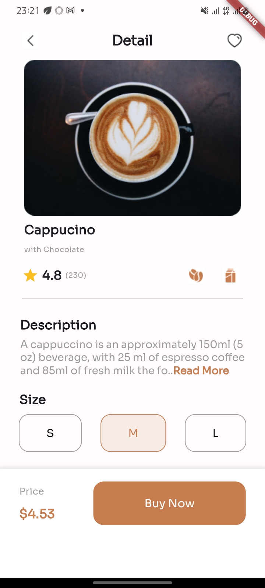

# Flutter Project - Cappucino
This a flutter project that contains a homepage of a Capuccino item
-   The page give details of the work capuccino
-   The various sizes to select from
-   The access to buy your favorite capuccino
-   The cost of the capuccino
## Design Concept / Methodology
-   The design page are into two sections, the appbar (containing the navigation) and body (containing other design features)
-   The Navbar components were designed and places in a class, in a module (Objects1.dart) in the lib DIR, imported in the main.dart and function called to be implemented.
-   The other body components were divided into 5 columns with row (children)
-   The components were objects2.dart to objects6.dart which were as well imported in the main.dart and function called
-   Texts were not hard coded in their components modules but instantiated in the function called in the main.dart
-   An assets dir was created with images and fonts as sub-dir
-   All images used in the projects are located in the images sub-dir
-   The Sora font was downloaded and copied to the fonts sub-dir
-   The respective paths of all the assets were added to the pubsec.yaml file
## Challenges Encountered
-  Due to my system not being able to install the emulator, I was able to use my android mobile device (developer option on) to debug and view the User Interface, (the screenshot as shown below)
-  I encountered issues trying to assign different styling to text, used ChatAI and Flutter.dev to understand how to use richtext
## Android User Interface Screenshot
-    This screenshot was taken on my mobile device
-    Created by Otuonyeaedike Chisom Golden (Group A)
-    First Academy
-    

